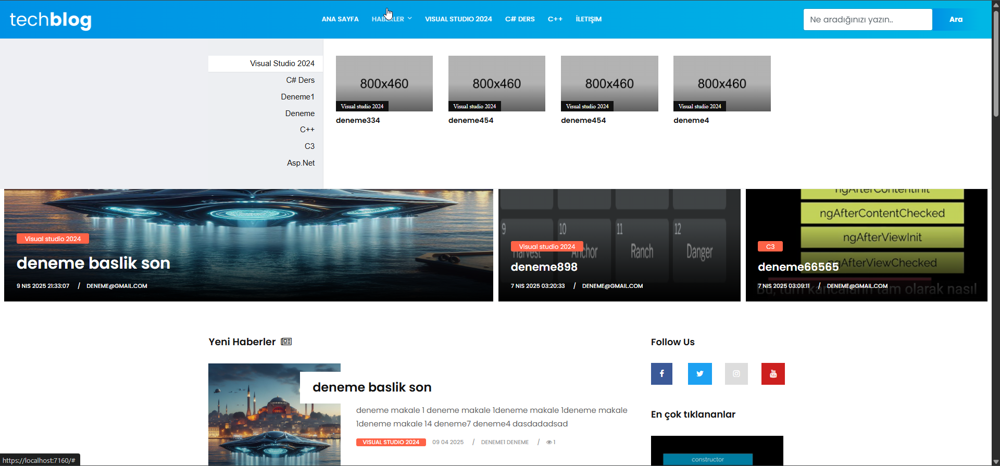
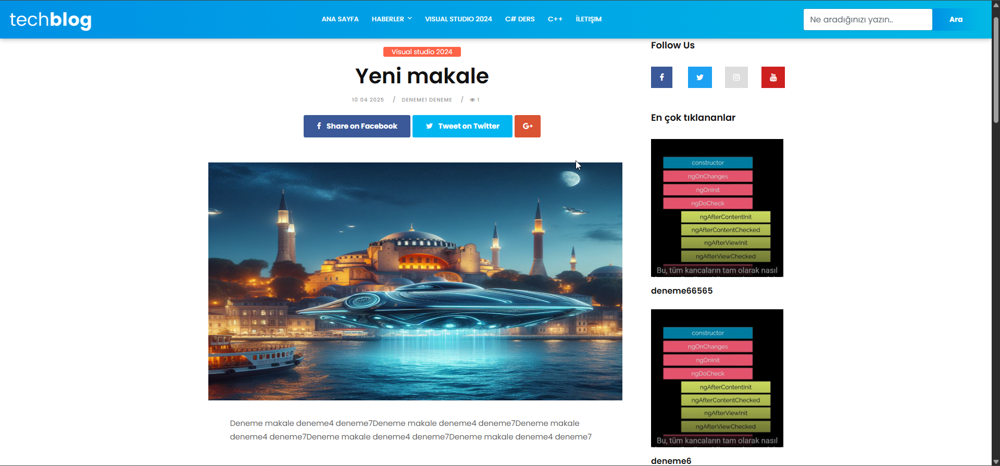
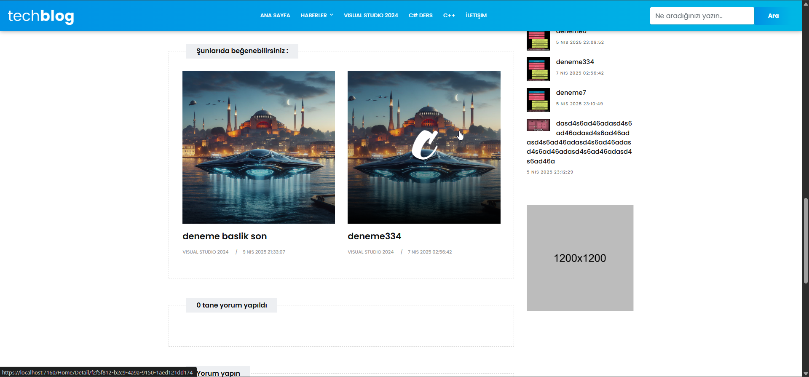
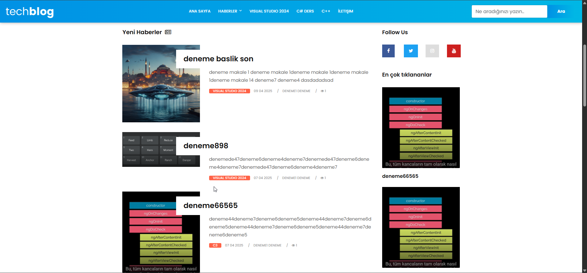
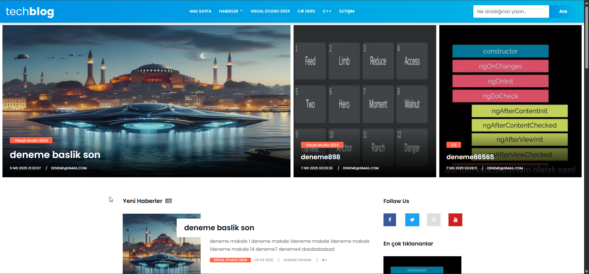
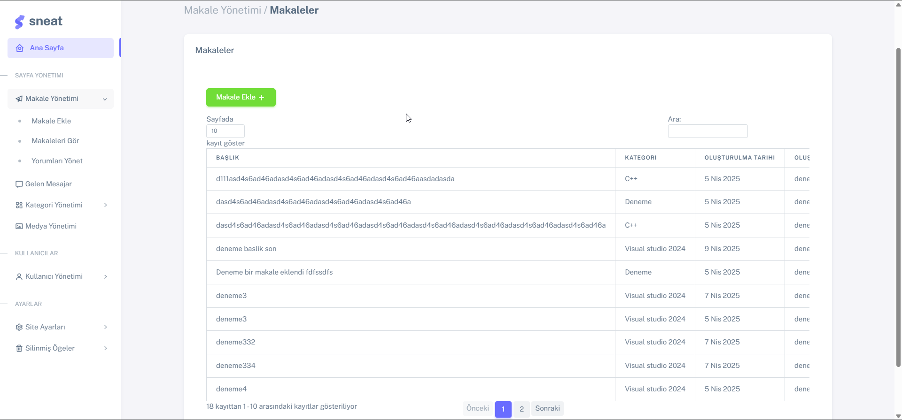
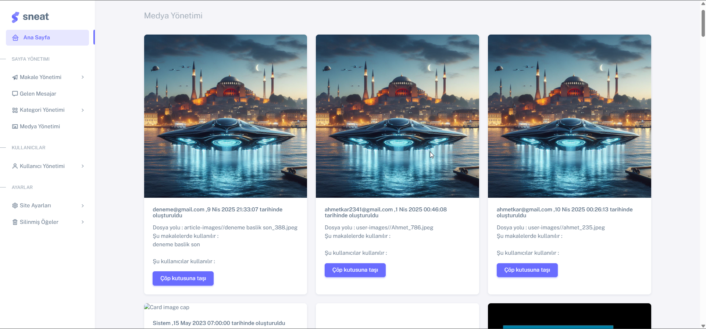
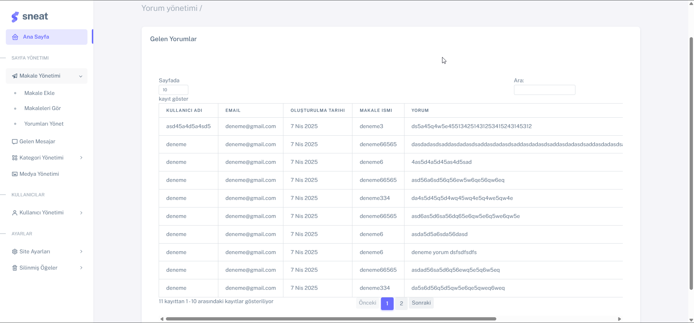
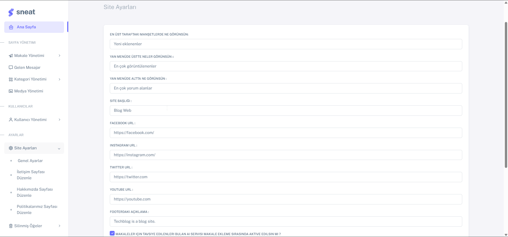
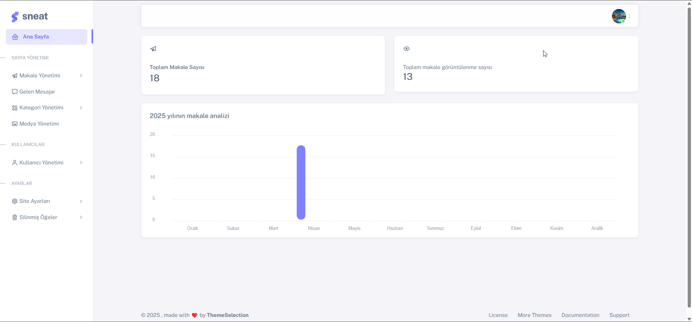

# .NET CORE MVC BLOG/HABER SİTESİ

Bu proje .Net core mvc ,jquery,html,css,EF Core,MSSQL kullanılarak yazılmıştır.
Projeyi yazılırken haber veya blog siteleri için kullanılması amaçlanmış ve backende odaklanılmıştır.

Çok katmanlı mimari ve çeşitli design patternlar kullanarak ölçeklenebilir,yönetilebilir kodlar yazılmıştır.

## Kullanılan Teknolojiler

- .NET CORE MVC ve WEB API
- AutoMapper
- Identity Service
- Entity Framework CORE
- MSSQL
- Fluent Validation
- JQUERY
- HTML-CSS
- BOOTSTRAP 5

## Kullanılan Mimari ve Design Pattern'lar

- Çok Katmanlı Mimari
- Unit Of Work Design Pattern
- Dependency Injection
- Generic Repository Design Pattern
- Clean Architecture

## Özellikler

- Admin paneli ile makale,yorum,kategori yönetimi
- Admin paneli ile resimlerin yönetimi
- Admin paneli ile kullanıcıların yönetimi
- Editörlerin admin paneli ile blog/haber ekleyebilmesi
- Admin paneli aracılığıyla kullanıcı tarafından görüntülenen blogların nereden geleceğinin berirlenmesi (Örn. çok görüntülenen,çok yorum alan, son eklenen vs.)
- Her eklenen makalenin önceki makaleler ile makine öğrenmesi aracılığıyla benzerliğinin hesaplanıp makale görüntüleme sayfasında benzer makalelerin tavsiye edilmesi
- Yorum yapılması,iletişim,arama 
- Sabit sayfaların içeriklerinin(iletişim,hakkımızda vs.) admin panelinden düzenlenebilmesi
- Admin panelinden silinenlerin tamamen silinmeyip çöp kutusuna gönderilmesi ve istenirse tamamen silinmesi

## Kullanılan temaların linkleri

Admin paneli için : [sneat](https://themewagon.com/themes/free-responsive-bootstrap-5-html5-admin-template-sneat/)

Site için : [blog-theme](https://www.free-css.com/free-css-templates/page244/tech-blog)

## Siteden Ekran Görüntüleri

## Admin Panelinden Ekran Görüntüleri

